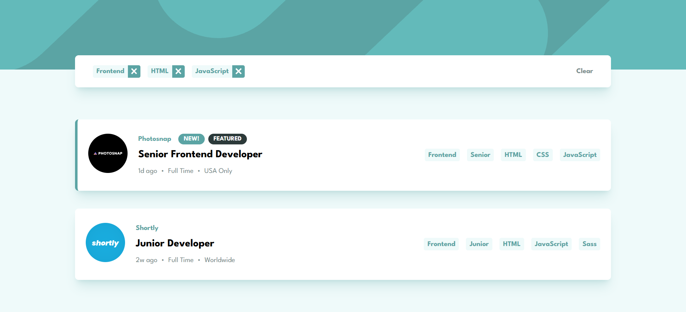

# 💼 Static Job Listings with Filtering

A responsive and interactive job board application built with React and Tailwind CSS. Users can filter job listings based on selected categories such as roles, levels, languages, and tools.

## 🔗 Links

- **Live Site:** [View Live Demo](https://job-listing-app-ten-wine.vercel.app/)
- **GitHub Repository:** [View Source Code](https://github.com/iviktorry/job-listing-app)

---

## 🛠 Tech Stack

- **React** — Component-based UI architecture, state management, and props pattern
- **Tailwind CSS v4** — Modern utility-first styling with custom CSS variables (`@theme`)
- **JavaScript (ES6+)** — Array manipulation methods (`filter`, `map`, `every`, `Set`)
- **Vite** — Fast and lightweight frontend build tool

---

## ✨ Features

- **Interactive Tag Filtering:** Click on any category tag (Role, Level, Languages, Tools) to filter the job list dynamically.
- **Multi-Category Match:** Filters jobs based on an _AND_ condition — shows only vacancies that contain **all** selected active filters.
- **Filter Management Bar:** Dedicated bar displaying current active filters with individual "remove" capabilities and a "Clear" button.
- **Conditional Layouts:** Clear button and filter bar automatically hide when no filters are selected.
- **Fully Responsive & Pixel-Perfect Design:** Customized layout using Tailwind CSS with desktop and mobile header variants based on Frontend Mentor designs.

---

## 🧠 What I Learned & Practiced

Building this project was a great hands-on practice for mastering React state flow, complex array operations, and dynamic UI rendering:

- **Complex Array Operations & Filtering:** Practiced working with arrays using `.filter()`, `.map()`, and `.every()` to construct filtering logic for multi-criteria matching.
- **State & Props Management:** Learned how to effectively lift state up and pass handlers and state data down to child components (`OffersList`, `Offer`).
- **Conditional Rendering:** Rendered UI blocks dynamically based on the state length (e.g., hiding the Filter Bar when no tags are selected).
- **Set & Array Methods for Uniqueness:** Utilized `Set` structures to prevent duplicate tags from being added to the active filter state.
- **Tailwind Dynamic Design:** Worked with custom CSS variables, semantic tags, and image components (`<picture>`) for optimized responsive headers.

---

## 🙋‍♀️ Author

- GitHub — [@iviktorry](https://github.com/iviktorry)
- Frontend Mentor — [@iviktorry](https://www.frontendmentor.io/profile/iviktorry)
